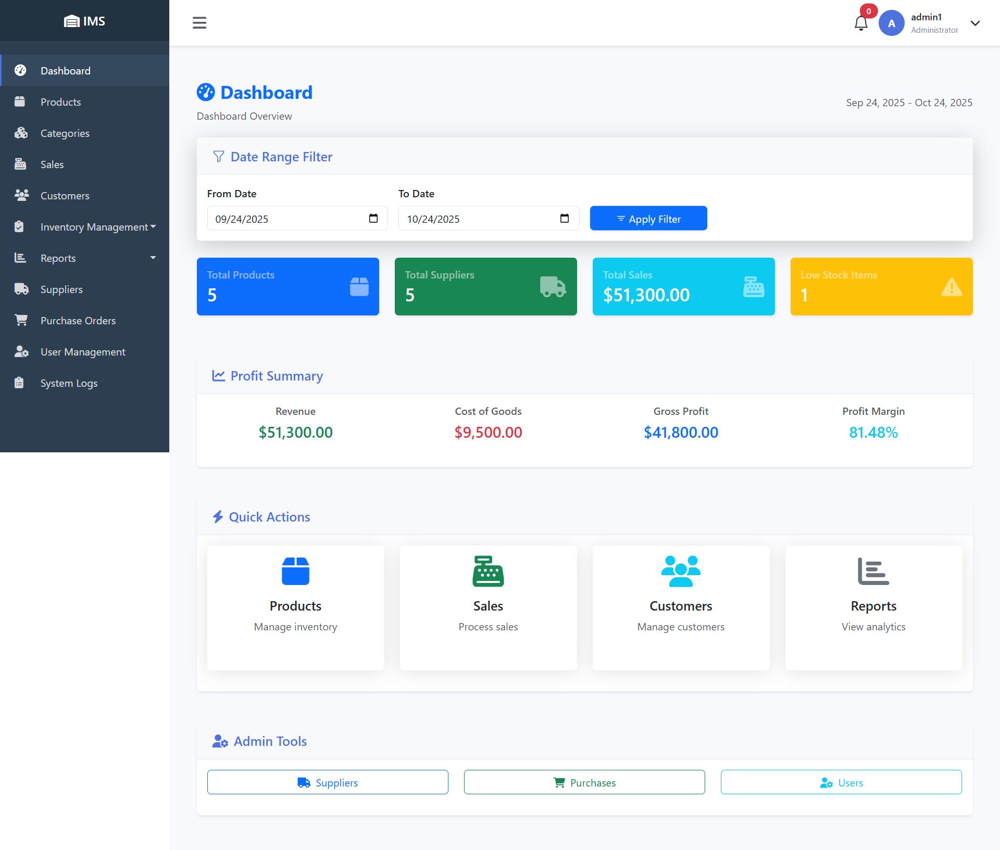
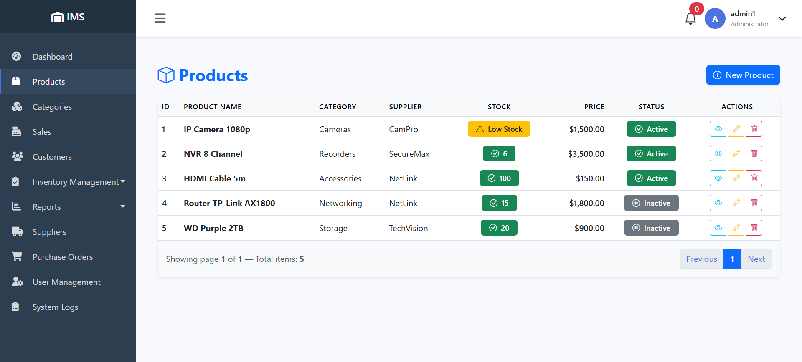
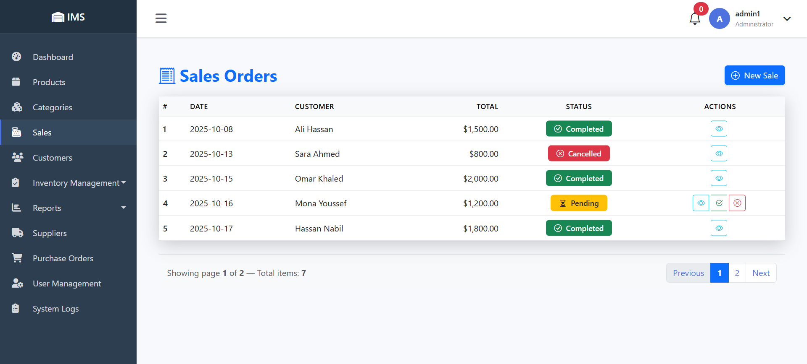

# Inventory Management System

A comprehensive inventory management system built with ASP.NET Core (.NET 9) using Razor Pages architecture, featuring real-time notifications, report generation, and complete inventory tracking.

## Table of Contents
- [Live Demo](#live-demo)
- [Features](#features)
- [Technical Stack](#technical-stack)
- [Architecture](#architecture)
- [Setup](#setup)
- [Screenshots](#screenshots)
- [Development](#development)
- [Contributing](#contributing)

## Live Demo
🚀 [Live Demo](https://inventorysystem1.runasp.net/)

Default Admin Credentials:
- Username: `admin@example.com`
- Password: `Admin123!`

## Features

### Inventory Management
- **Product Management**
  - Complete CRUD operations for products
  - Stock level tracking
  - Low stock alerts
  - Product categorization
  - Multiple suppliers per product

- **Category Management**
  - Hierarchical category structure
  - Category-based reporting
  - Product-category associations

- **Stock Control**
  - Real-time stock updates
  - Automatic reorder notifications
  - Stock adjustment history
  - Stock valuation reports

### Sales & Purchasing
- **Sales Management**
  - Create and manage sales orders
  - Customer management
  - Sales history tracking
  - Invoice generation (PDF)
  - Sales reports

- **Purchase Management**
  - Purchase order creation
  - Supplier management
  - Purchase history
  - Order tracking
  - Automated low stock notifications

### Reporting System
- **Sales Reports**
  - Daily/Weekly/Monthly sales
  - Product-wise sales
  - Customer-wise sales
  - Export to PDF/CSV

- **Inventory Reports**
  - Current stock levels
  - Stock valuation
  - Low stock items
  - Stock movement history

- **Purchase Reports**
  - Supplier-wise purchases
  - Product-wise purchases
  - Date range reports

### System Features
- **Real-time Notifications**
  - Low stock alerts
  - New order notifications
  - SignalR integration
  - Toast notifications

- **User Management**
  - Role-based access control (Admin/User)
  - Activity logging
  - User profiles
  - Secure authentication

- **Logging & Monitoring**
  - System activity logs
  - Error logging
  - User action tracking
  - Serilog integration

## Technical Stack

### Backend
- **Framework**: ASP.NET Core 9.0
- **Architecture**: Razor Pages
- **Database**: SQL Server with Entity Framework Core
- **Authentication**: ASP.NET Core Identity
- **Real-time**: SignalR
- **Logging**: Serilog
- **PDF Generation**: DinkToPdf
- **Mapping**: AutoMapper

### Frontend
- **Framework**: Bootstrap 5
- **JavaScript**: jQuery
- **Data Tables**: DataTables.net
- **Charts**: Chart.js
- **Icons**: Font Awesome, Bootstrap Icons
- **Notifications**: Toastr
- **Styling**: Custom SCSS/CSS

### Services (As per Program.cs)
- Authentication Service
- Category Service
- Customer Service
- Dashboard Service
- Inventory Service
- Logging Service
- Notification Service
- Product Service
- Purchase Service
- Report Service
- Sales Service
- Supplier Service
- User Profile Service

## Architecture

### Project Structure
```
InventorySystem/
├── InventorySystem.Web/                # Main web application
│   ├── Pages/                          # Razor Pages
│   ├── wwwroot/                        # Static files
│   ├── Mapping/                        # AutoMapper profiles
│   └── Program.cs                      # Application startup
│
├── InventorySystem.Core/               # Domain layer
│   ├── Entities/                       # Domain models
│   ├── Interfaces/                     # Service interfaces
│   ├── DTOs/                           # Data transfer objects
│   └── Hubs/                           # SignalR hubs
│
└── InventorySystem.Infrastructure/     # Data access layer
    ├── Data/                           # EF Core context
    ├── Repositories/                   # Data access
    ├── Services/                       # Business logic
    └── Migrations/                     # Database migrations
```

## Setup

### Prerequisites
```bash
# Required
- .NET 9.0 SDK
- SQL Server 2019+
- Node.js (for frontend tools)

# Optional
- Visual Studio 2022+ or VS Code
- SQL Server Management Studio
```

### Installation
1. Clone the repository:
```bash
git clone https://github.com/A7medabdelaty/InventorySystem.git
cd InventorySystem
```

2. Update connection string in `appsettings.json`:
```json
{
  "ConnectionStrings": {
    "DefaultConnection": "Server=.\\sqlexpress;Database=InventorySystem;Trusted_Connection=True;TrustServerCertificate=True;"
  }
}
```

3. Apply migrations:
```bash
dotnet ef database update --project InventorySystem.Infrastructure --startup-project InventorySystem
```

4. Run the application:
```bash
dotnet run --project InventorySystem
```

## Screenshots

### Dashboard

- Real-time statistics
- Stock alerts
- Recent activities

### Products

- Product listing
- Stock levels
- Quick actions

### Sales

- Sales creation
- Customer selection
- Product selection

## Development

### Adding New Features
1. Create feature branch
2. Implement changes
3. Add tests
4. Create pull request

### Coding Standards
- Follow C# coding conventions
- Use meaningful names
- Add XML documentation
- Include comments

## Contributing
1. Fork the repository
2. Create your feature branch
3. Commit your changes
4. Push to the branch
5. Create a pull request

## License
This project is licensed under the MIT License - see the [LICENSE](LICENSE) file for details.
